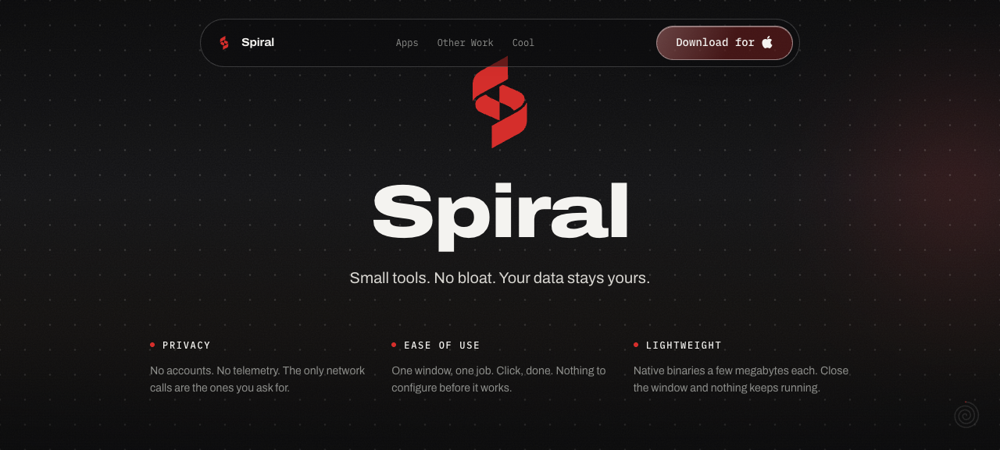

<div align="center">


# Spiral

**Small tools. No bloat. Your data stays yours.**

Every Spiral app, the brand system they share, and the site that houses them.
One repository — each app is a folder, not a separate project.

[**spiralcc.tech**](https://spiralcc.tech)

On a Mac, one line gets you the app:

```
brew install --cask cococool13/spiral/spiral-wallpaper
```

[](https://github.com/cococool13/spiral/actions/workflows/build.yml)

[](LICENSE)



</div>

Three promises, kept the same way in every app:

- **Privacy.** No account. No telemetry. No network request you did not ask
  for. Where an app talks to the internet at all, it names the host it talks
  to and talks to nothing else.
- **Ease.** One window, one job. Everything the app is about to do is on
  screen before it does it. Close the window and the app is gone — nothing
  keeps running.
- **Lightweight.** Native binaries measured in megabytes. Tauri and Rust, not
  Electron.

## The apps

| App | What it does | Status | Get it |
| --- | --- | --- | --- |
| [**Spiral Wallpaper**](apps/wallpaper/) | Click a wallpaper, it downloads and applies. Browses [Wallhaven](https://wallhaven.cc). 4.6 MB binary, ~95 MB idle RAM, window on screen in 0.23 s. | **v1.0.3** — macOS + Windows | [Download](https://github.com/cococool13/spiral/releases/latest) |
| [**Spiral Slim**](apps/slim/) | Debloats and hardens Brave, Chrome, Edge, and Firefox with enterprise policies the browsers respect natively. Shows every change before it makes it. | **v1.0.0** — macOS app, scripts everywhere | [Download](https://github.com/cococool13/Spiral-Slim/releases/latest) · [Read the scripts](apps/slim/) |
| [**Spiral Clean**](apps/clean/) | Reclaims disk space and uninstalls apps, macOS only. Every removal is proven safe by a Rust test suite before it ships. | Unreleased — Clean and Uninstall built | [Design spec](apps/clean/docs/design-spec.md) |
| [**Spiral Resume**](apps/Resume/) | Your resume in twelve typeset layouts, as a PDF or a Word file. It tightens the wording and is never allowed to change a fact. | **v0.1.1** — first downloadable release, macOS + Windows | [Download](https://github.com/cococool13/spiral/releases/tag/resume-v0.1.1) |

Spiral Resume is the one app that breaks the megabyte promise, and it says so
here rather than quietly: it embeds the Typst typesetter so that the preview and
the exported PDF come from one engine and cannot disagree. Measured on an Apple
silicon build of 0.1.0, that costs **61 MB installed and a 29 MB download** —
against Wallpaper's 4.6 MB. 16 MB of that is the offline engine the release
bundles; without it the same build is 45 MB installed. The published release is
universal and carries both architectures, so it is larger again. Every other app in the table is measured
in single-digit megabytes.

Spiral Dashboard, Weather, Transcribe, and Chat are named on the site and not
yet started. They are ideas, not promises.

## Install

### On a Mac, in one line

If you have [Homebrew](https://brew.sh), paste one of these into Terminal:

```bash
brew install --cask cococool13/spiral/spiral-wallpaper
```

```bash
brew install --cask cococool13/spiral/spiral-slim
```

That's the whole install. To update later, `brew upgrade --cask spiral-wallpaper`.
To remove an app and everything it saved, `brew uninstall --zap --cask spiral-wallpaper`.

### On a Mac, without Homebrew

1. Download the `.dmg` from the [latest release](https://github.com/cococool13/spiral/releases/latest).
2. Open it.
3. Drag the app into Applications.

Done. Apple has checked these apps (they are signed and notarized), so they
open normally — no right-click, no security warning to click past.

### On Windows

1. Download the `.exe` from the [latest release](https://github.com/cococool13/spiral/releases/latest).
2. Run it.
3. Windows shows a blue **"Windows protected your PC"** box. Click **More
   info**, then **Run anyway**.

That box appears because the file is not code-signed yet, not because anything
is wrong with it. Signing costs money and is on the list.

Spiral Slim has no Windows download on purpose — on Windows you run its script
instead. [Here's how](apps/slim/).

### Want to check the file is the real one?

Every release includes `SHA256SUMS.txt`. Compare it to the file you downloaded:

```bash
shasum -a 256 ~/Downloads/Spiral.Wallpaper_1.0.3_universal.dmg
```

If the line matches, the file is byte-for-byte what was published here.

<div align="center">


<sub>The Browse screen. Thumbnails above are dev-preview placeholders; the app browses Wallhaven.</sub>

</div>

Everything the app does is stated on-screen before it happens. Downloaded
files are verified to actually be images before they touch disk. The
thumbnail cache is capped at 200 MB and says so in Settings.

## Build it yourself

You need [Node 22+](https://nodejs.org), [pnpm](https://pnpm.io), and
[Rust](https://rustup.rs). On a Mac, also run `xcode-select --install`. On
Windows, install Microsoft C++ Build Tools.

Then:

```bash
git clone https://github.com/cococool13/spiral.git
cd spiral/apps/wallpaper
pnpm install
pnpm tauri dev
```

The app opens. `pnpm tauri build` instead of `pnpm tauri dev` makes an
installer you can keep.

Swap `apps/wallpaper` for `apps/clean`, `apps/Resume` or `apps/slim/desktop` to
run one of the others the same way.

Two extra commands, if you're changing the code: `pnpm build` refuses to
finish if any colour is outside the design tokens or TypeScript complains, and
`pnpm smoke` runs the app end to end — search, download, set the wallpaper —
then puts your old wallpaper back. It exits non-zero when it fails, so it can
gate a release.

## What's in this repo

Three top-level areas, one job each.

```
brand/         the design system — every colour, font, and mark lives here
apps/          one folder per app — shipped, in progress, or still just docs
collection/    the spiralcc.tech website
docs/          product context, visual system, external reference
```

This repo is the one true source for every Spiral product. Product planning
material (ADRs, context docs) lives here even before there's code — `apps/clean/`
started that way, and its ADRs still sit beside the code they became.

| Path | What | Start here when… |
| --- | --- | --- |
| [`brand/`](brand/) | Tokens, fonts, logos, brand guide. **Single source of truth** — nothing else defines brand values. See [`brand/README.md`](brand/README.md). | changing a colour, font, or mark |
| [`apps/wallpaper/`](apps/wallpaper/) | Spiral Wallpaper: React + TypeScript UI, Rust/Tauri core, DMG + NSIS installers | working on the desktop app |
| [`apps/slim/`](apps/slim/) | Spiral Slim: stdlib-only Python (Brave/Chrome/Edge/Firefox on Linux, macOS, Windows) plus [`apps/slim/desktop/`](apps/slim/desktop/) — a Tauri wizard over the macOS script. macOS shipped and notarized; Windows built and registry-tested on every push in CI | working on Brave policy config |
| [`apps/clean/`](apps/clean/) | Spiral Clean: a native macOS maintenance app — Clean, Storage, Optimize, Uninstall, plus History and Settings. macOS only, unreleased. **Feature-complete: every screen is built.** 428 Rust tests, 97 Vitest, a native smoke gate, and nineteen ADRs. See its own [README](apps/clean/README.md) | working on the maintenance app |
| [`apps/Resume/`](apps/Resume/) | Spiral Resume: a resume goes in, a typeset PDF or Word file comes out, and no fact is ever changed. macOS + Windows. First downloadable release **v0.1.1**. Import, the Check screen where every extracted fact is editable, twelve templates rendered by an embedded Typst, PDF and DOCX export, and three engine tiers. 218 Rust tests plus 76 Vitest tests. See the [design spec](apps/Resume/docs/design-spec.md) | shipping the resume app |
| [`collection/`](collection/) | The landing site that houses every app. Next.js + Tailwind, static export, deployed to Cloudflare Pages. **Plays by different rules than the apps** — see [`collection/README.md`](collection/README.md) | working on the website |
| [`docs/`](docs/) | [`PRODUCT.md`](docs/PRODUCT.md), [`DESIGN.md`](docs/DESIGN.md), [`reference/`](docs/reference/), build specs | you need context, not code |
| [`CLAUDE.md`](CLAUDE.md) / [`AGENTS.md`](AGENTS.md) | The build briefs: brand rules, stack decisions, scope | an agent is picking up work |

**Brand assets are never duplicated.** Each surface copies what it needs out of
`brand/` at build time into a gitignored folder — `collection/public/brand/`,
`collection/public/brand/`, and `src/assets/brand/` plus `src/styles/tokens.css`
inside `apps/wallpaper`, `apps/clean` and `apps/Resume`. Edit `brand/`, never a
synced copy.

## Working on it

Each area is a self-contained pnpm project. There is no root workspace — `cd`
into the one you want.

```bash
cd apps/wallpaper    && pnpm install && pnpm tauri dev   # the desktop app
cd apps/slim/desktop && pnpm install && pnpm tauri dev   # the Brave wizard
cd apps/clean        && pnpm install && pnpm tauri dev   # the maintenance app
cd apps/Resume       && pnpm install && pnpm tauri dev   # the resume app
cd collection        && pnpm install && pnpm dev         # the website (localhost:3000)
```

| Command | Where | What it does |
| --- | --- | --- |
| `pnpm build` | `apps/wallpaper` | hex-token guard → typecheck → Vite build |
| `pnpm tauri build` | `apps/wallpaper` | release bundles (.app/.dmg, .exe/.msi) |
| `pnpm build` | `apps/clean` | hex-token guard → typecheck → Vite build |
| `pnpm test` | `apps/clean` | the frontend suite (Vitest). `pnpm build` does not run it |
| `cargo test` | `apps/clean/src-tauri` | the safety-core suite — run it before any change to `remove`, `exclude`, or `paths` |
| `pnpm smoke` | `apps/clean` | the native gate: runs the app against this Mac and exits non-zero if any data source fails |
| `pnpm build` | `apps/Resume` | hex-token guard → typecheck → Vite build |
| `pnpm test` | `apps/Resume` | the frontend suite (Vitest). `pnpm build` does not run it |
| `cargo test` | `apps/Resume/src-tauri` | the parser, the fact gate, the templates, and both export halves |
| `pnpm build` | `collection` | static export into `out/` |
| `pnpm typecheck` | `collection` | `tsc --noEmit` |
| `pnpm sync-brand` | any app or `collection` | re-copy brand assets from `brand/` |

The design system is eight colors, two fonts, two radii, and one easing
curve, enforced by the build. When in doubt, open the brand guide at
[`brand/guide.html`](brand/guide.html).

## Cutting a release

Releases are tag-driven. Pushing a `v*` tag builds macOS (signed, notarized,
universal) and Windows, then publishes both together with `latest.json` for the
updater and `SHA256SUMS.txt` for anyone verifying a download.

Each app owns a tag namespace, so one release never drags the others along:

| App | Tag | Builds |
| --- | --- | --- |
| Spiral Wallpaper | `v*` | macOS + Windows, updater manifest |
| Spiral Slim | `slim-v*` | macOS |
| Spiral Clean | `clean-v*` | macOS only. No updater yet — the Tauri plugin panics without a signing key, so the key has to exist first |
| Spiral Resume | `resume-v*` | macOS + Windows, no updater |

All four call the same reusable `.github/workflows/release-app.yml`.

A Spiral Resume release carries all three engine tiers. Each runner compiles
its own `llama-server` before packaging — a sidecar is a native compile, not a
cross-compile — and the bundle config that declares it is merged at build time,
so a machine without the binary can still compile and test the app. The model
itself is not in the release: it is a 2.7 GB download the user chooses in
Settings, verified against a pinned checksum before it is installed.
[`apps/Resume/docs/offline-model.md`](apps/Resume/docs/offline-model.md) is the
record of what had to be true first.

```bash
# the tag must match the app's package.json and src-tauri/tauri.conf.json —
# `node scripts/version.mjs check` proves all four version files agree first
git tag vX.Y.Z && git push origin vX.Y.Z

# or let the release script do the bump, the commit and the tag for you
node scripts/release.mjs clean 0.1.0           # bump, commit, tag — nothing pushed
node scripts/release.mjs resume 0.1.0          # Spiral Resume, tag resume-v0.1.0
node scripts/release.mjs clean 0.1.0 --push    # ...and push it
```

The workflow refuses to publish a partial release. It stops before building if
a signing or notarization secret is missing, and the manifest step throws
rather than emitting a `latest.json` without signatures — an unsigned macOS
build is blocked by Gatekeeper, and a bundle with no `.sig` breaks the updater
for everyone already running the previous version.

### After a macOS release: bump the Homebrew cask

`brew install --cask cococool13/spiral/<app>` is served by
[`cococool13/homebrew-spiral`](https://github.com/cococool13/homebrew-spiral),
a separate repo only because Homebrew requires taps to be named `homebrew-*`.
A release is not finished until its cask points at it — until then `brew`
installs the previous version.

Edit `Casks/<app>.rb` in that repo: set `version`, and set `sha256` to the
line for the `.dmg` in the new release's `SHA256SUMS.txt`. Then:

```bash
brew audit --cask --online cococool13/spiral/<app>
```

Homebrew verifies the checksum on every install, so a stale `sha256` does not
install the wrong file — it fails loudly, which is the right failure but still
a broken install command.

### One-time setup

```bash
./scripts/setup-release-secrets.sh
```

Reads the signing identity and team ID from your keychain, asks for the four
things it cannot derive, checks the certificate password actually opens the
`.p12` before uploading anything, and pipes each value straight to
`gh secret set`. Nothing is printed or written to disk.

`macos` needs these repository secrets, in addition to the
`TAURI_SIGNING_PRIVATE_KEY` the Windows job already uses:

| Secret | What it is |
| --- | --- |
| `APPLE_CERTIFICATE` | Developer ID Application `.p12`, base64-encoded |
| `APPLE_CERTIFICATE_PASSWORD` | password for that `.p12` |
| `APPLE_SIGNING_IDENTITY` | e.g. `Developer ID Application: NAME (TEAMID)` |
| `APPLE_ID` | Apple ID used for notarization |
| `APPLE_PASSWORD` | app-specific password for that Apple ID |
| `APPLE_TEAM_ID` | the team the certificate belongs to |

## Roadmap, stated plainly

**Wallpaper** is at v1.0.3 with a signed and notarized universal macOS build.
Next: Windows signing and the remaining runtime pass on real Windows hardware.
On hold: additional wallpaper sources (Unsplash and Pexels shipped briefly
and were removed; the `WallpaperSource` interface is waiting for them). Out
of scope for v1: animated wallpapers, auto-update, anything that phones home.

**Clean** has every screen built and every gate green. Four things stand
between it and a `clean-v0.1.0` tag, and none of them is code anyone can write
today:

1. **Nobody has seen it rendered.** The app has never been opened. The smoke
   gate proves every data source answers on a real Mac; it draws nothing. This
   is the gate.
2. **Signing** needs the Developer ID in the build environment.
3. **Notarization** needs the Apple ID and an app-specific password.
4. **The updater cannot be written yet.** The Tauri plugin reads
   `plugins.updater.pubkey` at init and panics without it, so the key has to be
   generated before the first line of updater code exists. `release-clean.yml`
   passes `updater: false` until then.

Out of scope for Clean v1, deliberately: a menu bar HUD or anything resident,
scheduled cleaning, duplicate and large-file finders, `node_modules`, and any
network call whatsoever.

**Resume** first downloads as **v0.1.1** (`resume-v0.1.1`): import, the Check
screen, twelve templates, PDF and Word export, and three engine tiers. macOS is
signed and notarized; Windows is unsigned, the same accepted gap as Wallpaper.
The `resume-v0.1.0` tag never produced a DMG. Homebrew needs a cask in
`cococool13/homebrew-spiral` — that step is not CI. Do not use `/releases/latest`
for Resume; that URL is Wallpaper.

**Slim** is done for what it set out to do. It stays script-first on every
platform by design — see [`apps/slim/SECURITY.md`](apps/slim/SECURITY.md).

---

[MIT licensed](LICENSE), except [`apps/slim/`](apps/slim/), which is
[GPL-3.0](apps/slim/LICENSE) — it began as a fork of
[SlimBrave Neo](https://github.com/ChaoticSi1ence/SlimBrave-Neo).
Wallpapers from [Wallhaven](https://wallhaven.cc). Spiral is not affiliated
with either.
