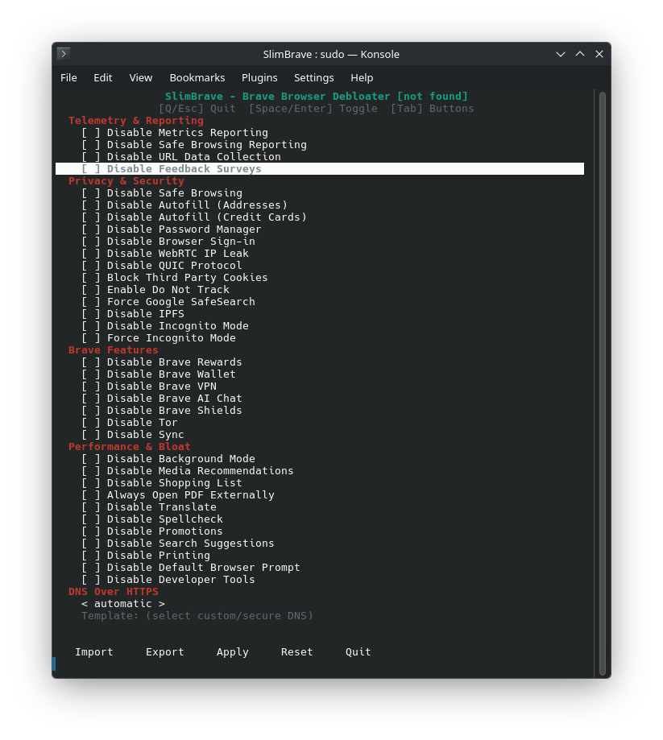

<div align="center">

# SlimBrave Neo


**Debloat and harden Brave Browser on Linux, macOS, and Windows.**

[](https://python.org)
[]()
[](LICENSE)
[]()
[]()
[]()

SlimBrave Neo uses Chromium enterprise managed policies to disable telemetry, bloat, and unwanted features in Brave Browser. No browser extensions, no hacks, just clean policy enforcement that Brave respects natively.

</div>

> [!IMPORTANT]
> **The only official source of SlimBrave Neo is this repository:**
> [`github.com/ChaoticSi1ence/SlimBrave-Neo`](https://github.com/ChaoticSi1ence/SlimBrave-Neo)
>
> This project ships **source code only**. Python and PowerShell scripts you can read before running.
> **There are no official `.exe`, `.msi`, `.dmg`, `.pkg`, installers, or compiled binaries.**
> If you find a download claiming to be SlimBrave-Neo elsewhere, it is not from this project. See [`SECURITY.md`](SECURITY.md).

> [!NOTE]
> **Linux users: consider [Brave Origin](https://brave.com/origin/linux/nightly/) first.**
> Brave Origin is a free, official Brave variant that ships with telemetry and bloat already removed. If you just want a clean Brave without configuration, that's the simpler path.
>
> The Linux version of SlimBrave Neo is still fully supported, and is the right tool if you want fine-grained control over individual policies, custom presets, or your own DoH templates beyond what Origin provides out of the box.

<div align="center">

---



*Interactive curses TUI. Zero dependencies, runs in any terminal.*

</div>

---

## Quick Start

### Linux

```bash
git clone https://github.com/ChaoticSi1ence/SlimBrave-Neo.git
cd SlimBrave-Neo
sudo python3 slimbrave-linux.py
```

That's it. No `pip install`, no `jq`, no external dependencies. Just Python 3 and root.

**CLI mode (non-interactive):**

```bash
sudo python3 slimbrave-linux.py --import "./Presets/Maximum Privacy Preset.json"
sudo python3 slimbrave-linux.py --export ~/SlimBraveNeoSettings.json
sudo python3 slimbrave-linux.py --reset
```

**Multiple Brave channels (Stable / Beta / Nightly):** Brave hardcodes the managed-policy directory to `/etc/brave/policies` for every channel, so a single policy file applies to all of them — no per-channel selector is needed. If multiple channels are installed, leaked Shields exceptions are scrubbed from each channel's user-data directory and "Brave is running" detection covers all installed channels.

After applying, restart Brave and verify at `brave://policy`.

### macOS

**Easiest option:** after downloading or cloning the repository, double-click
`Apply SlimBrave on macOS.command`. It applies the recommended **Maximum
Performance + Privacy** preset to every installed Brave channel and opens the
macOS Device Management screen for the one required profile approval. Before
asking for your password, it shows a read-only preview of the detected channels,
policy count, persistence method, and how many values will change.

The launcher keeps Safe Browsing, QUIC, hardware acceleration, and automatic
secure DNS available. It disables telemetry and unused Brave services, enforces
Shields privacy protections, and enables balanced memory saving. It is a
plain-text shell script and uses the same auditable Python tool shown below.

**Terminal / custom setup:**

```bash
git clone https://github.com/ChaoticSi1ence/SlimBrave-Neo.git
cd SlimBrave-Neo
sudo python3 slimbrave-mac.py
```

Requires root. Policies are written to `/Library/Managed Preferences/com.brave.Browser.plist` by default; with `--persist on` SlimBrave also prepares a durable Apple Configuration Profile.

**Persistence on macOS (Apple Silicon / macOS 13+).** On modern macOS, `cfprefsd` and `mdmclient` may clear directly-written `/Library/Managed Preferences/*.plist` files at reboot when no Configuration Profile backs them, so policies don't always survive a restart. SlimBrave Neo offers two modes:

| Mode | What it does | Persists | User action |
|------|--------------|----------|-------------|
| `off` (default) | Writes the plist only | may reset on macOS 13+ | just `sudo` |
| `on` | Writes a matching fallback plist, then installs an Apple Configuration Profile via System Settings | yes after approval | `sudo` + one-time GUI install |

When `--persist` is omitted on the CLI, the mode currently installed on the Mac is reused, so a re-run never silently demotes an installed profile back to plist-only. A fresh install defaults to `off`.

When you click Apply in the TUI, SlimBrave Neo asks two macOS-only questions in order: which Brave channels to manage (only when more than one is installed), then whether to persist across reboots. Both prompts have a sticky default — Enter keeps whichever scope and mode are currently installed.

```bash
sudo python3 slimbrave-mac.py --import "./Presets/Maximum Privacy Preset.json" --persist on
sudo python3 slimbrave-mac.py --import "./Presets/Maximum Performance and Privacy Preset.json" --persist on
sudo python3 slimbrave-mac.py --import "./Presets/Maximum Privacy Preset.json" --persist off
sudo python3 slimbrave-mac.py --reset
```

**Finishing the Configuration Profile install (macOS 26).** With `--persist on`, SlimBrave Neo applies a matching plist immediately, writes a `.mobileconfig`, and opens System Settings. macOS 11+ disallows CLI-driven profile installs, so you finish the durable step in the GUI: a "Profile Downloaded" notification appears; in System Settings click **General** → **Device Management**, scroll down to **Downloaded**, double-click **SlimBrave Neo - Brave Policy**, click **Install**, and enter your login password. Any previously installed SlimBrave profile remains active until macOS accepts its replacement. To uninstall, run `--reset` or remove the profile under the same Device Management pane. Reference: [Apple — Install configuration profiles on Mac](https://support.apple.com/guide/mac-help/mh35561/mac).

**CLI mode (non-interactive):**

```bash
sudo python3 slimbrave-mac.py --import "./Presets/Maximum Privacy Preset.json"
sudo python3 slimbrave-mac.py --export ~/SlimBraveNeoSettings.json
sudo python3 slimbrave-mac.py --reset
sudo python3 slimbrave-mac.py --import preset.json --channels stable,beta
sudo python3 slimbrave-mac.py --import preset.json --persist on
python3 slimbrave-mac.py --preview preset.json --channels auto --persist on
python3 slimbrave-mac.py --catalog
python3 slimbrave-mac.py --catalog --format json
```

After applying, restart Brave and verify at `brave://policy`.

### Windows

```powershell
iwr "https://raw.githubusercontent.com/ChaoticSi1ence/SlimBrave-Neo/main/SlimBrave.ps1" -OutFile "SlimBrave.ps1"; .\SlimBrave.ps1
```

Requires Administrator privileges.

---

## Features

### Telemetry & Reporting
- Disable Metrics Reporting
- Disable Safe Browsing Reporting
- Disable URL Data Collection
- Disable P3A Analytics
- Disable Stats Ping

### Privacy & Security
- Disable Safe Browsing
- Disable Autofill (Addresses & Credit Cards)
- Disable Password Manager
- Disable Browser Sign-in
- Enable Do Not Track
- Enable Global Privacy Control
- Enable De-AMP (strip Google AMP wrappers)
- Enable Debouncing (skip known tracking redirect hops)
- Strip Tracking URL Parameters
- Reduce Language Fingerprinting
- Enforce Shields ad and tracker blocking
- Enforce fingerprinting protection
- Prefer HTTPS upgrades
- Restrict cross-site referrers
- Disable WebRTC IP Leak
- Disable QUIC Protocol
- Block Third Party Cookies
- Force Google SafeSearch
- Disable / Force Incognito Mode (mutually exclusive)

### Brave Features
- Disable Brave Rewards
- Disable Brave Wallet
- Disable Brave VPN
- Disable Brave AI Chat
- Disable Brave Local AI
- Disable Email Aliases
- Disable Brave Shields
- Disable Brave News
- Disable Brave Talk
- Disable Brave Playlist
- Disable Web Discovery
- Disable Speedreader
- Disable Tor
- Disable Sync
- Disable IPFS

### Performance & Bloat
- Disable Background Mode
- Enable Memory Saver with balanced savings
- Disable Google Cast
- Disable Autoplay
- Disable Shopping List
- Always Open PDF Externally
- Disable Translate
- Disable Spellcheck
- Disable Search Suggestions
- Disable Printing
- Disable Default Browser Prompt
- Disable Developer Tools
- Disable Wayback Machine

### DNS Over HTTPS
- Four modes: `automatic`, `off`, `secure`, `custom`
- Custom DoH template URL support (e.g. `https://cloudflare-dns.com/dns-query`)
- Inline editable template field in the TUI

---

## CLI Reference

| Flag | Description |
|------|-------------|
| `--import PATH` | Import a SlimBrave Neo JSON config and apply policies |
| `--preview PATH` | Validate an import and show its targets and change counts without requiring root or changing files |
| `--catalog` | Discover bundled presets and tool capabilities without requiring root; use `--format json` for collection integration |
| `--format FORMAT` | Output `text` or stable, machine-readable `json` for `--catalog` and `--preview` |
| `--export PATH` | Export current policy to a SlimBrave Neo JSON config |
| `--reset` | Remove the managed policy file |
| `--policy-file PATH` | Override policy file path |
| `--doh-templates URL` | Set custom DNS-over-HTTPS template URL |
| `--channels LIST` | Comma-separated channels to target (`stable,beta,nightly`). Default `auto` = all detected. macOS writes one plist per channel; Linux always shares a single policy file. |
| `--persist MODE` | macOS persistence: `off` (plist only; may reset after reboot on macOS 13+) or `on` (install an Apple Configuration Profile via System Settings; durable, Apple-recommended). Omitted = reuse whatever mode is currently installed; falls back to `off` if nothing is. Linux ignores this flag — its `/etc/brave/policies` file is already durable. |
| `-h`, `--help` | Show help |

Import/export uses the same JSON format as the Windows PowerShell version. Configs are cross-platform compatible.

### Collection integration

SlimBrave exposes a read-only discovery interface for launchers and tool
collections. `--catalog --format json` returns schema-versioned tool metadata,
entrypoints, platform-specific capabilities, and every bundled preset with a stable ID. A
machine-readable preview is available through `--preview PATH --format json`.
Both operations run without administrator privileges and set
`mutates_system: false` where applicable. The same catalog is also available
directly through `python3 slimbrave_catalog.py --format json`.
See [`docs/COLLECTION_INTEGRATION.md`](docs/COLLECTION_INTEGRATION.md) for the
versioning, safety, and adapter contract intended for a larger tool collection.

---

<details>
<summary><strong>Presets</strong></summary>

### Maximum Performance + Privacy Preset
- **Privacy:** Enforces Shields ad/tracker and fingerprinting protection, blocks third-party cookies, limits referrers and WebRTC IP exposure, and prefers HTTPS.
- **Telemetry:** Disables Chromium metrics, Brave P3A/stats, URL-keyed collection, and extended Safe Browsing reporting.
- **Performance:** Disables background mode, autoplay, Cast discovery, local AI models, and unused Brave services; enables balanced Memory Saver to reduce RAM without overly aggressive tab reloads.
- **Security:** Keeps standard Safe Browsing, QUIC, hardware acceleration, and automatic secure DNS available instead of trading them away for cosmetic hardening.
- **Best for:** The recommended fast, private daily-driver configuration, especially on macOS through the double-click launcher.

### Maximum Privacy Preset
- **Telemetry:** Blocks all reporting (metrics, safe browsing, URL collection, feedback).
- **Privacy:** Disables autofill, password manager, sign-in, WebRTC leaks, QUIC, and forces Do Not Track.
- **Brave Features:** Kills Rewards, Wallet, VPN, AI Chat, Tor, and Sync.
- **Performance:** Disables background processes, recommendations, and bloat.
- **DNS:** Uses plain DNS (no HTTPS) to prevent potential logging by DoH providers.
- **Best for:** Paranoid users, journalists, activists, or anyone who wants Brave as private as possible.

### Balanced Privacy Preset
- **Telemetry:** Blocks all tracking but keeps basic safe browsing.
- **Privacy:** Blocks third-party cookies, enables Do Not Track, but allows password manager and autofill for addresses.
- **Brave Features:** Disables Rewards, Wallet, VPN, and AI features.
- **Performance:** Turns off background services and ads.
- **DNS:** Uses automatic DoH (lets Brave choose the fastest secure DNS).
- **Best for:** Most users who want privacy but still need convenience features.

### Performance Focused Preset
- **Telemetry:** Only blocks metrics and feedback surveys (keeps some safe browsing).
- **Brave Features:** Disables Rewards, Wallet, VPN, and AI to declutter the browser.
- **Performance:** Kills background processes, shopping features, and promotions.
- **DNS:** Automatic DoH for a balance of speed and security.
- **Best for:** Users who want a faster, cleaner Brave without extreme privacy tweaks.

### Developer Preset
- **Telemetry:** Blocks all reporting.
- **Brave Features:** Disables Rewards, Wallet, and VPN but keeps developer tools.
- **Performance:** Turns off background services and ads.
- **DNS:** Automatic DoH (default secure DNS).
- **Best for:** Developers who need dev tools but still want telemetry and ads disabled.

### Strict Parental Controls Preset
- **Privacy:** Blocks incognito mode, forces Google SafeSearch, and disables sign-in.
- **Brave Features:** Disables Rewards, Wallet, VPN, Tor, and dev tools.
- **DNS:** Uses custom DoH (can be set to a family-friendly DNS like Cloudflare for Families).
- **Best for:** Parents, schools, or workplaces that need restricted browsing.

</details>

---

## How It Works

SlimBrave Neo writes Chromium [managed enterprise policies](https://chromeenterprise.google/policies/) to platform-specific locations. Brave reads these on startup and enforces the policies. No browser modifications needed.

| Platform | Policy Location |
|----------|----------------|
| Linux | `/etc/brave/policies/managed/slimbrave.json` (shared across all channels) |
| macOS — `--persist off` | `/Library/Managed Preferences/com.brave.Browser{,.beta,.nightly}.plist` (one per selected channel). |
| macOS — `--persist on` | Matching fallback plist plus an Apple Configuration Profile installed via System Settings → General → Device Management. The profile is authoritative after approval. |
| Windows | Registry keys via PowerShell |

**Additional behavior:**
- Auto-detects Brave installations: Arch (`brave-bin`), deb/rpm, Flatpak, Snap, macOS App (Stable / Beta / Nightly), and PATH fallback
- Reads existing policies on startup and pre-checks matching features; on macOS, the Apply-time channel prompt pre-ticks channels that already have a SlimBrave-managed policy (sticky default)
- Full overwrite on Apply, so unchecked features are cleanly removed
- Import/export compatible with Windows PowerShell version (handles UTF-16 BOM encoding)

---

<details>
<summary><strong>Requirements</strong></summary>

**Linux:**
- Python 3 (no external dependencies)
- Root privileges (`sudo`)
- Brave Browser installed (any packaging method)

**macOS:**
- Python 3 (no external dependencies)
- Root privileges (`sudo`)
- Brave Browser installed

**Windows:**
- Windows 10/11
- PowerShell
- Administrator privileges

</details>

<details>
<summary><strong>Windows: "Running Scripts is Disabled on this System"</strong></summary>

Run this command in PowerShell:

```powershell
Set-ExecutionPolicy -ExecutionPolicy RemoteSigned
```

</details>

---

## Roadmap

- [x] Add preset configurations (Privacy, Performance, etc.)
- [x] Import/export settings (cross-platform compatible)
- [x] Add Linux support with full interactive TUI
- [x] DNS-over-HTTPS with custom template URLs
- [x] CLI mode for scripting and automation
- [x] macOS support via managed plist policies
- [x] Multi-channel support on macOS (Stable / Beta / Nightly)

---

## Contributors

- **[@alsyundawy](https://github.com/alsyundawy)** - macOS version
- **[@zhaoJianNet](https://github.com/zhaoJianNet)** - macOS refinements
---

<div align="center">

**Like this project? Give it a star!**

Made with Python and PowerShell.

[](LICENSE)

</div>
